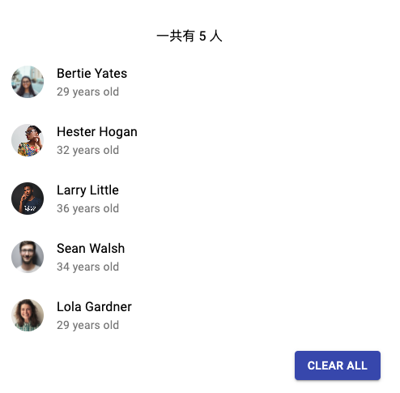

# 15 个React项目练习

* 教程Github地址：https://github.com/john-smilga/react-projects


1. BirthdayList：从本地文件读取json列表数据，调用`map`方法映射成列表组件，并且支持一键清空操作

   

   * 要点：

     1. 习惯让高层组建传递**数据**给下层数据渲染，使用数据来作为划分组建的要点

     2. 通过`userEffect`的方式来达到`componentDidLoad`的目的，在第一次渲染后加载数据

     


2. Tours：获取Tours的数据，每个数据也包含图片、旅游价格、文字介绍。并且文字介绍还支持**show more/show less**的折叠选项

   

   

   * 内容

     1. 根据不同状态返回不同的渲染结果：loading状态时展示提示；数据成功获取后展示数据；数据被清空后展示刷新数据的按钮
     2. 提示文字的折叠状态切换
     3. 点击图片删除单个项目

   * 要点

     * 多个不同组件之间的关系整理，理清楚数据应该存储的位置。因为App中需要管理到loading，而loading的状态和target data相关，所以这两项state都保存在App中，而不是Tours组件中

       ```
       App (loading, tours)
       |-- Loading 
       |-- Tours
           |-- Tour (expanding)
       ```

       

3. 